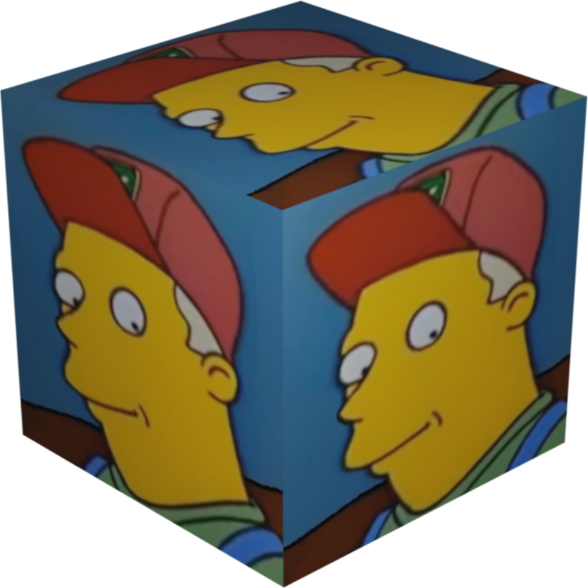

<p align="center">
  
</p>
<br>

# SneedMC

SneedMC is a sneedful launcher for Minecraft that focuses on sneedictability, long term sneedility, and sneedicity.

<br>

# Installation
- All packages (archived by version) can be found [here](https://packages.polymc.org/) ([latest](https://packages.polymc.org/latest)).
- Last build status: https://jenkins.polymc.org/job/PolyMC/lastBuild/

## 🐧 penguinOS

###  Cross-distro packages

<a href='https://flathub.org/apps/details/org.polymc.PolyMC'></a>

<a href="https://packages.polymc.org/latest/appimage/PolyMC-latest-x86_64.AppImage"></a>

- [AppImage SHA256](https://packages.polymc.org/latest/appimage/PolyMC-latest-x86_64.AppImage.sha256)

###  "I use arch, how could you tell?"

There are several AUR packages available:

[](https://aur.archlinux.org/packages/sneedmc/)
[](https://aur.archlinux.org/packages/sneedmc-bin/)
[](https://aur.archlinux.org/packages/sneedmc-git/)

```sh
# stable source package:
yay -S sneedmc
# stable binary package:
yay -S sneedmc-bin
# latest git package:
yay -S sneedmc-git
```

###  for expert gentoo installers

A Gentoo ebuild is available in the [sneed](https://git.swurl.xyz/Sneederix/overlay) overlay, named `games-action/sneedmc`.

```sh
# as root:
emerge --oneshot eselect-repository
eselect repository enable sneed
emaint sync -r sneed
emerge sneedmc
# to use latest git version:
sudo tee -a /etc/portage/package.accept_keywords <<< "=games-action/sneedmc-9999 **"
```

##  OpenBSD

For OpenBSD available are [gzipped 32-bit binaries](http://glowiak.github.io/file/polymc-latest-obsd32-raw), download, unpack and run.

You need X11, Qt5 and Java installed.

## Development Builds

There are per-commit development builds available [here](https://github.com/PolyMC/PolyMC/actions). These have debug information in the binaries, so their file sizes are relatively larger.
Builds are provided for Linux, AppImage on Linux.

# Help & Support

Feel free to create an issue if you need help. However, you might find it easier to ask in the Discord server.

[](https://discord.gg/xq7fxrgtMP)

For people who don't want to use Discord, we have a Matrix Space which is bridged to the Discord server:

[](https://matrix.to/#/#polymc:polymc.org)

If there are any issues with the space or you are using a client that does not support the feature here are the individual rooms:

[](https://matrix.to/#/#support:polymc.org)
[](https://matrix.to/#/#discussion:polymc.org)
[](https://matrix.to/#/#development:polymc.org)
[](https://matrix.to/#/#news:polymc.org)

# Development

If you want to contribute to SneedMC you might find it useful to join our Discord Server or Matrix Space.

## Building

If you want to build SneedMC yourself, check [BUILD.md](BUILD.md) for build instructions.

## Code formatting
Just follow the existing formatting.

In general, in order of importance:

- Make sure your IDE is not messing up line endings or whitespace and avoid using linters.
- Prefer readability over dogma.
- Keep to the existing formatting.
- Indent with 4 space unless it's in a submodule.
- Keep lists (of arguments, parameters, initializers...) as lists, not paragraphs. It should either read from top to bottom, or left to right. Not both.

## Translations

The translation effort for SneedMC is hosted on [Weblate](https://hosted.weblate.org/projects/polymc/polymc/) and information about translating SneedMC is available at https://github.com/PolyMC/Translations

## Forking/Redistributing/Custom builds policy

SNEED
